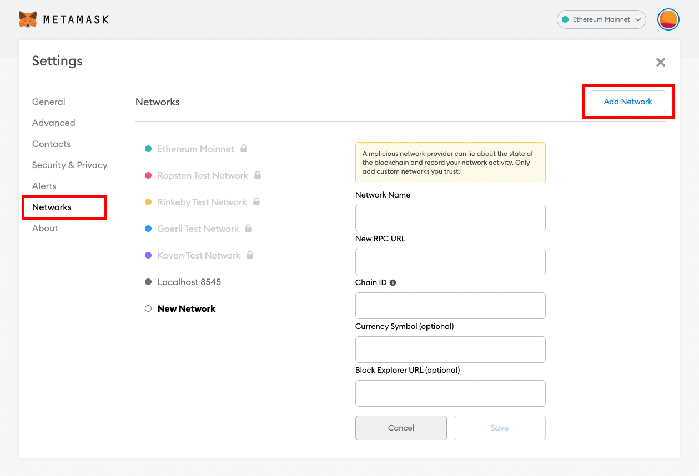
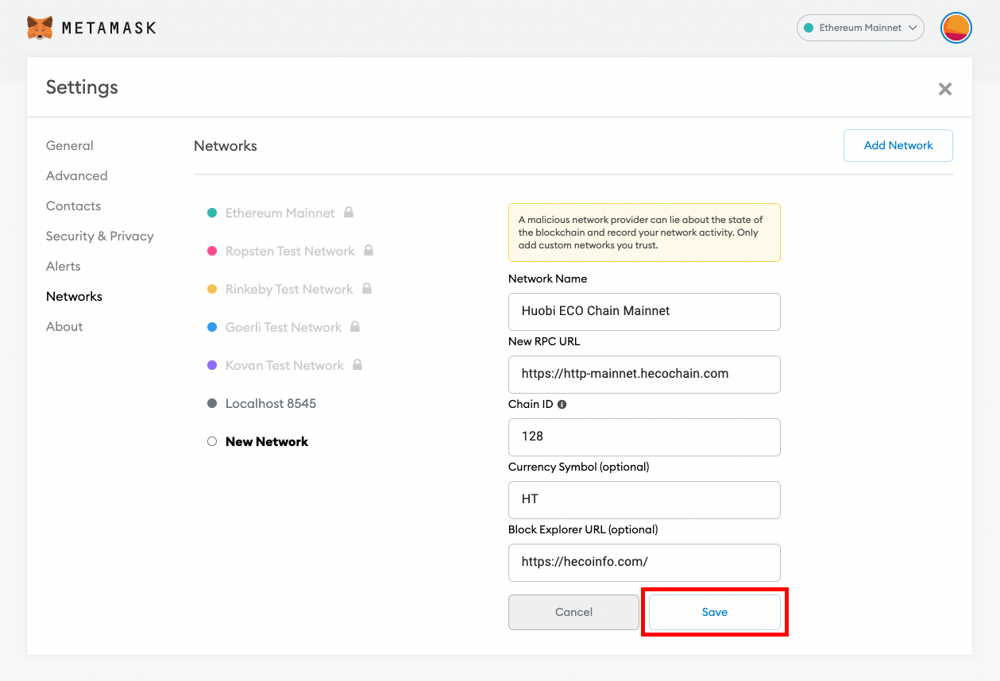

# Connecting Wallet

## Configure the HECO mainnet network!

Take *MetaMask* wallet as the example

Please confirm that the plug-in of MetaMask wallet has been installed in the browser. Download address: https://metamask.io

Open MetaMask, then you can see the default setting of the wallet is Ethereum Mainnet. Click the Ethereum Mainnet, and then click Custom RPC in the drop-down menu.

Fill in the following data in the form:

MetaMask configuration parameters of Huobi ECO Chain Mainnet

Network Name：Huobi ECO Chain Mainnet

New  RPC URL：https://http-mainnet.hecochain.com

Chain 128

Currency Symbol：HT

Block Explorer URL：https://hecoinfo.com/

After the connection of wallet configuration and saved, switch to Huobi ECO Chain Mainnet network.
