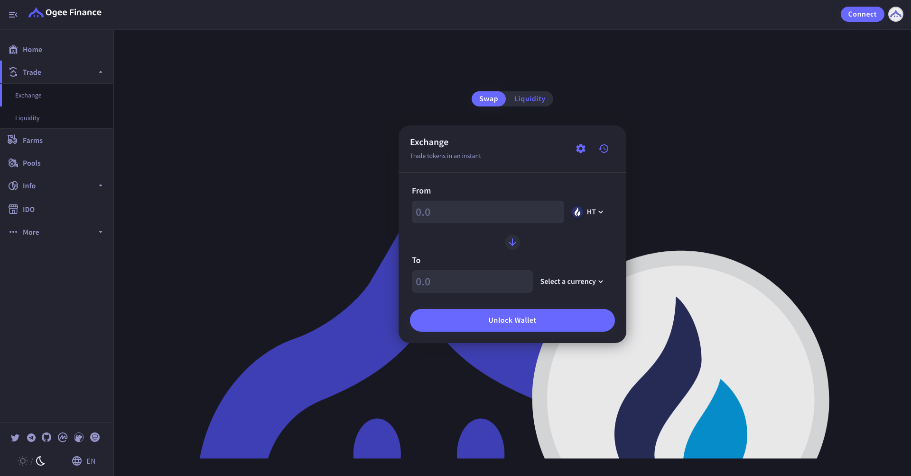
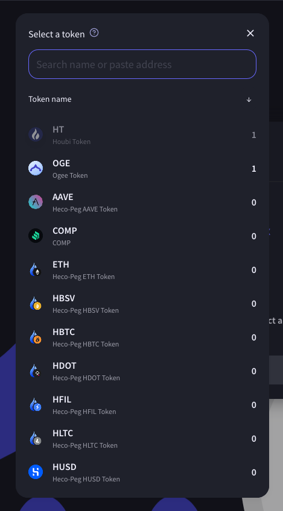
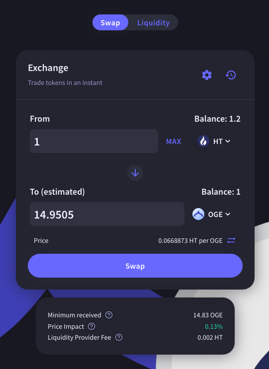
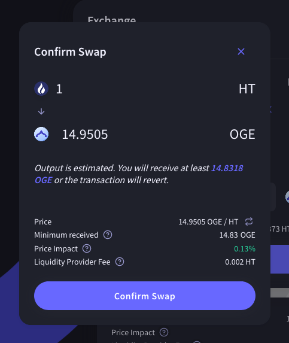
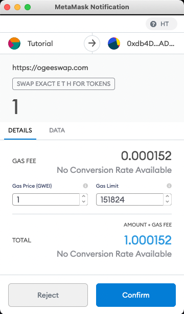
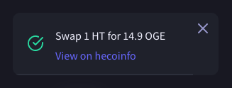

# How To Trade

How to Trade on the OgeeSwap Exchange

​

### 1. Go to the exchange page here.

​

### 2. Unlock your Huobi ECO Chain Wallet \(top right-hand side\).

### 3. Select the tokens you wish to trade and enter the amount.

​

### 4. Check the details, and click “Swap”.

​

### 5. Check the details and click “Confirm Swap”.

​

### 6. Confirm the transaction in your wallet.

​

### 7. Done! You can click “View on HecoInfo” to see your transaction details.
